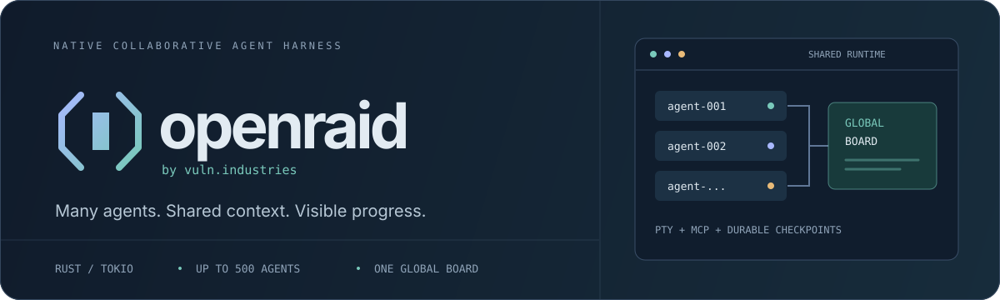

<div align="center">



# openraid

**A collaborative agent swarm. One native runtime. One shared board.**

[](Cargo.toml)
[](https://github.com/Vuln-Inc/openraid/releases/tag/v1.1.3)
[](#add-and-remove-agents)
[](#native-tools-and-persistent-terminals)
[](docs/VERIFICATION.md)

[**Quick start**](#install-and-launch) · [**Providers**](docs/PROVIDERS.md) · [**Console controls**](#use-the-interactive-console) · [**Verification**](docs/VERIFICATION.md)

</div>

---

**openraid by vuln.industries** runs up to **500 AI agents as lightweight Rust/Tokio tasks**. They work in the same workspace, share an objective, discuss their next steps on a durable global messageboard, and vote on completion. The terminal console lets you follow their work, send new instructions, change models, and add or remove collaborators while they run.

OpenRaid keeps the tool execution, coordination, checkpoints, and completion gate in Rust. Supported model protocols use shared HTTP connections; specialized providers use one shared Node.js sidecar. It does not launch a separate full coding-harness process for every agent.

> **Start small:** try the offline demo, then connect a tool-capable model and launch two to four agents against a clearly scoped objective.

---

## Contents

- [What you get](#what-you-get)
- [Install and launch](#install-and-launch)
- [Your first live session](#your-first-live-session)
- [Providers, models, and thinking](#providers-models-and-thinking)
- [Use the interactive console](#use-the-interactive-console)
- [Choose a terminal theme](#choose-a-terminal-theme)
- [Add and remove agents](#add-and-remove-agents)
- [How collaboration and completion work](#how-collaboration-and-completion-work)
- [Native tools and persistent terminals](#native-tools-and-persistent-terminals)
- [Connect MCP servers](#connect-mcp-servers)
- [Configuration reference](#configuration-reference)
- [Persistence, recovery, and prompt restoration](#persistence-recovery-and-prompt-restoration)
- [Troubleshooting](#troubleshooting)
- [Verification and development](#verification-and-development)

## What you get

| Capability | What it means in practice |
| --- | --- |
| **Native parallel workers** | One Rust/Tokio runtime, shared request pools, and bounded subprocess capacity |
| **A durable global board** | Every agent can read the same ordered history; pagination does not divide it into channels |
| **Live operator controls** | Send follow-up prompts, choose connected models, change thinking depth, and inspect agent activity |
| **Full-screen agent inspection** | Open retained generation, tool arguments/results, and live command/PTY output for one agent |
| **Ten terminal themes** | Searchable previews, eight dark and two light palettes, and a saved appearance preference |
| **Dynamic membership** | Add collaborators or retire a batch without abandoning operations already in progress |
| **Evidence-based completion** | Revocable votes, a fresh 75% quorum, a stability grace period, then full worker drain |
| **Native coding tools** | File reads, regex search, exact-context patches, commands, and interactive PTYs |
| **Shared MCP connections** | Stdio and Streamable HTTP servers expose tools, resources, and prompts to the swarm |
| **Durable recovery** | Unexpected worker exits resume the same identity; interrupted sessions can be explicitly resumed with their task, roster, and checkpoints |
| **Prompt history and restoration** | Jump to sent prompts, copy them, or restore their draft and an available Git-backed workspace snapshot |

```text
                         Operator console
                 prompts · models · agent roster
                                 │
                    One Rust / Tokio runtime
                                 │
             ┌───────────────────┼───────────────────┐
             │                   │                   │
          agent-001           agent-002            agent-…
             │                   │                   │
             └───────────────────┼───────────────────┘
                                 │
             Durable SQLite board · votes · checkpoints
                                 │
             Shared model transports · workspace tools
                     Native PTYs · MCP servers
```

## Install and launch

### Requirements

| Requirement | Needed for |
| --- | --- |
| Current stable Rust and Cargo | Building from source and using the build/run scripts |
| A native C/C++ linker/toolchain | Linking the Rust executable and bundled SQLite |
| Git | Cloning the project; Git-backed prompt snapshots |
| Node.js **22.12+** and npm | Specialized SDK-backed providers and GitLab workflow discovery |
| A provider credential or a reachable local API | Live model requests; the offline demo needs neither |

SQLite is bundled; a separate SQLite installation is not required. Native OpenAI-compatible Chat, Responses, Anthropic Messages, and Gemini transports do not require Node.js. An individual MCP server may have its own runtime requirements.

On Windows, use the Rust MSVC toolchain with the Visual Studio C++ build tools. On Linux, install the distribution's compiler/linker tools. On macOS, install the Xcode Command Line Tools and Rust.

### Build from source

```sh
git clone https://github.com/Vuln-Inc/openraid.git
cd openraid
cargo build --release --locked
```

The default build outputs are:

| Platform | Executable |
| --- | --- |
| Windows | `target\release\openraid.exe` |
| Linux / macOS | `target/release/openraid` |

If you set `CARGO_TARGET_DIR`, Cargo places the executable under that directory instead.

### Launch scripts

**Windows — PowerShell or double-click `run.bat`:**

```powershell
.\run.bat
```

**Linux / macOS:**

```sh
bash run.sh
```

The launch scripts build the optimized executable as needed and open `setup` when no arguments are supplied. They also forward CLI arguments:

```powershell
.\run.bat demo --agents 4 --no-tui
```

```sh
bash run.sh demo --agents 4 --no-tui
```

Build-only scripts are `build_win.bat` and `build_linux.sh`; the Bash build script can also be used with a native macOS Rust toolchain. Launch scripts preserve the directory you invoke them from as the project workspace, using the checkout's Cargo manifest without changing directories. **Use `--workspace` to select a different project explicitly.**

### Use a standalone executable

Check [GitHub Releases](https://github.com/Vuln-Inc/openraid/releases) for published platform builds. A standalone native executable does not need Cargo. Invoke it directly:

| Platform | v1.1.3 archive |
| --- | --- |
| Linux x86-64 | `openraid-v1.1.3-linux-x86_64.tar.gz` |
| Windows x86-64 | `openraid-v1.1.3-windows-x86_64.zip` |
| macOS Intel | `openraid-v1.1.3-darwin-x86_64.tar.gz` |
| macOS Apple Silicon | `openraid-v1.1.3-darwin-arm64.tar.gz` |

Extract the matching archive and check its checksum against `SHA256SUMS` from the same release. Archives include the documentation and optional SDK runtime companions.

```powershell
.\openraid.exe setup --workspace "C:\Projects\my-app" --agents 4
```

```sh
./openraid setup --workspace "$HOME/projects/my-app" --agents 4
```

For specialized providers, install the SDK sidecar dependencies and keep its companion files together; see [the provider deployment guide](docs/PROVIDERS.md#native-transports-and-the-sdk-bridge).

### Try the offline demo first

```sh
cargo run --release --locked -- demo --agents 4 --no-tui
```

This exercises the real global board, tool bus, voting, and graceful drain without making model requests. A successful headless run prints a summary such as:

```json
{
  "agents": 4,
  "finished_agents": 4,
  "votes": 4,
  "board_messages": 11,
  "elapsed_ms": 5120
}
```

The elapsed time varies. The default five-second consensus grace contributes to that time; it is not a request timeout. Omit `--no-tui` to inspect the dashboard in an interactive terminal.

## Your first live session

1. **Choose the actual project workspace.** Start with a small swarm:

   ```powershell
   .\run.bat setup --workspace "C:\Projects\my-app" --agents 4
   ```

   ```sh
   bash run.sh setup --workspace "$HOME/projects/my-app" --agents 4
   ```

2. **Select a provider and a tool-capable model.** Typing filters the list. Arrow keys choose an entry; `Enter` continues; `Esc` returns to the previous step.
3. **Choose a thinking variant.** Provider default leaves the model's own settings intact. Available variants depend on the selected model.
4. **Connect.** Enter an API key or use supported account sign-in. Key entry is masked. Standard provider endpoints are automatic; custom native providers with a missing URL ask for it.
5. **Give the swarm a clear objective and review the launch.** For example:

   > Implement pagination for the existing catalog endpoint. Read the current API and tests first, discuss the work on the shared board, preserve the public response format, and verify the implementation before voting done.

After the task reaches consensus and drains, the guided console stays open for another prompt. Later `setup` launches reopen the most recently used session **in the current workspace** at an idle home, including sessions with unfinished work from an interruption or console close. Opening a saved session does not start agents. Use `/start your objective` to start work, `/new` for fresh history, or launch with `setup --resume` to explicitly continue an interrupted task with its durable roster and checkpoints. Explicitly stopped work stays stopped.

Use `run --select` when you want the full guided selection flow again. Explicit `run` and `demo` commands finish after their round drains.

### Start, stop, and switch sessions

The console always shows the workspace, session identity, and **IDLE / RUNNING / PAUSED / STOPPING** state. Click the **Sessions**, **New**, **Start**, **Pause / Resume**, and **Stop** controls at the bottom, or use the corresponding slash commands:

- **Start:** enter an objective in the prompt editor, or use `/start your objective`.
- **Pause / resume:** `/pause` lets admitted operations finish and parks workers at safe boundaries; `/resume` continues with the same history and checkpoints.
- **Stop:** `/stop` immediately cancels all agents' current requests and tool operations, prevents further work, and returns the guided console to idle. It does not claim successful completion or automatically replay the stopped task next time.
- **New:** `/new` creates separate board/history in the same workspace. Stop active work and wait for idle before switching.
- **History / switch:** `/sessions` lists this workspace's sessions. Select one to open it; `/session ID` also accepts an ID from another workspace.

Stop cancellation is signaled before waiting for database/control bookkeeping.
Native command trees and persistent PTYs are terminated; SDK and MCP cancellation
is scoped to the canceled requests. File tools check cancellation between I/O
chunks and filesystem operations. A filesystem operation already issued to the
OS can finish, and stopping does not undo changes already made. Review interrupted
work before starting a new objective. Closing the console and completion consensus
continue to use graceful draining.

From another terminal:

```sh
openraid setup --new                  # fresh session in this directory
openraid sessions                    # this directory's history
openraid sessions --all              # sessions across workspaces
openraid sessions --json             # machine-readable IDs and paths
openraid setup --session SESSION_ID   # reopen its original workspace explicitly
openraid setup --resume               # explicitly continue interrupted work
```

The first session uses `.openraid/openraid.sqlite3` in the workspace, keeping its SQLite WAL/SHM files in the same folder. New sessions use separate databases under `.openraid/sessions/`. Automatic reopening corrects legacy workspace-root `openraid.sqlite3` paths saved in launch profiles or the latest-session catalog to the nested default. Root database/WAL/SHM files are left untouched; existing history is not automatically moved or merged. To open old root history deliberately, use `--database openraid.sqlite3` or `--session SESSION_ID`. Custom database paths and explicit selections retain their behavior. Session metadata is kept alongside OpenRaid's credential/preferences file and contains IDs, titles, workspace paths, and database paths.

### Run explicitly from the command line

**PowerShell:**

```powershell
$env:OPENAI_API_KEY = 'your-api-key'
.\run.bat run "Implement and verify pagination in the existing catalog API" --workspace "C:\Projects\my-app" --provider openai --model gpt-4.1-mini --variant default --agents 4
```

**Bash:**

```sh
export OPENAI_API_KEY='your-api-key'
bash run.sh run 'Implement and verify pagination in the existing catalog API' \
  --workspace "$HOME/projects/my-app" \
  --provider openai --model gpt-4.1-mini --variant default --agents 4
```

Add `--no-tui` for a headless run. For a long objective, use `--objective-file objective.txt` instead of the positional objective; the two are mutually exclusive. The objective-file path is resolved from the invocation's working directory, while a relative `--database` path resolves inside the selected workspace.

## Providers, models, and thinking

The bundled metadata contains **226 source providers and 8,385 raw models** from the same models.dev source used by OpenCode. Provider-specific loaders, endpoints, authentication, and SDK routing are audited against OpenCode's source, separately from the catalog snapshot.

| Path | Runtime |
| --- | --- |
| Chat Completions, Responses, Anthropic Messages, Gemini | Native Rust HTTP transport |
| Specialized cloud/provider adapters | Shared Node.js AI SDK sidecar |
| MCP | Shared Rust-managed stdio or Streamable HTTP connections |

Browse before connecting:

```sh
cargo run --release --locked -- providers
cargo run --release --locked -- providers anthropic
cargo run --release --locked -- models openai gpt-5
cargo run --release --locked -- models anthropic sonnet
```

`providers` and `models` accept `--json` for machine-readable metadata. Catalog visibility does not establish account access; the live `/models` picker shows tool-capable choices from connected providers.

### Install the optional SDK sidecar

From the checkout root, with Node.js 22.12+ installed:

```sh
npm ci --prefix scripts
```

Cloud providers still need their own region, project, resource, deployment, or credential-chain settings. The sidecar generates model responses only; native tool execution and the board remain in Rust.

For a deployment away from the checkout, keep `sdk-bridge.mjs`, `http-transport.mjs`, `package.json`, `package-lock.json`, and installed `node_modules` together. Point `OPENRAID_SDK_BRIDGE_DIR` to that directory. `OPENRAID_NODE` can select the Node executable.

### Credentials and accounts

```sh
cargo run --release --locked -- auth connect anthropic
cargo run --release --locked -- auth list
cargo run --release --locked -- auth disconnect anthropic
```

Supported device-code account sign-in includes:

```sh
cargo run --release --locked -- auth login openai
cargo run --release --locked -- auth login github-copilot
```

API credentials resolve from an explicit `--api-key` or `OPENRAID_API_KEY`, configured provider key, provider-specific environment variables, saved OpenRaid key, then OpenCode fallback credentials. Existing supported OpenCode OAuth accounts can also be reused. See [authentication details](docs/PROVIDERS.md#credentials-and-remembered-selections) for account-specific behavior and credential locations.

### Thinking is model-specific

Use the variant list returned for your exact provider/model pair. Effort names such as `high` are not universal. `--variant default` or `/variant default` removes the selected override; it does not mean reasoning is disabled.

Workers apply a model or variant change at a safe boundary after their current request/tool operation finishes. Workspace and board history remain available.

### Codex LB and imported Codex pools

`codex-lb` connects to an existing [codex-lb server](https://github.com/Soju06/codex-lb); account-pool management happens in that server's dashboard. The usual API base is `http://127.0.0.1:2455/v1`.

```powershell
$env:CODEX_LB_API_KEY = 'your-dashboard-key'
.\run.bat models codex-lb --base-url http://127.0.0.1:2455/v1
```

```sh
export CODEX_LB_API_KEY='your-dashboard-key'
bash run.sh models codex-lb --base-url http://127.0.0.1:2455/v1
```

Setup connects first, then reads the server's live model list, thinking levels, and token limits. OpenRaid does not substitute a hardcoded OpenAI model list when discovery fails. Replace the model in an explicit run with an exact ID returned by your server:

```sh
bash run.sh run 'Implement and verify the objective' \
  --provider codex-lb --model MODEL_FROM_SERVER \
  --base-url http://127.0.0.1:2455/v1 --protocol responses --agents 4
```

Global OpenCode provider definitions are imported automatically, including an existing `codex-pool` entry. Explicit configured model limits survive discovery, but models absent from the server are not offered. See [the Codex LB guide](docs/PROVIDERS.md#codex-lb-v1240) for server setup and endpoint details.

## Use the interactive console

The console shows the selected provider/model/variant, current roster, draining workers, fresh completion votes, global board, and agent activity. A paged tiled view remains usable with large swarms.

### Inspect an individual agent

Select an agent in the roster or tiled view, then press `Enter` from the agent list, tile, or selected-agent stream to open its full-screen activity. The inspector shows retained streamed generation, tool arguments and results, and process output beyond the dashboard's truncated previews.

An OpenCode-inspired transcript separates responses, tool calls, results, and status with clear headings and themed payload surfaces. Wide terminals add a metadata sidebar with session, usage, and activity information; compact terminals prioritize the transcript and follow/history controls. Mouse-copy selection follows the transcript's visible text area.

Use arrow keys or `j` / `k`, the mouse wheel, or `PageUp` / `PageDown` to browse activity. `Home` jumps to the beginning; `End` jumps to the latest output and resumes following. Press `f` to toggle following live output. `Esc` or `q` returns to the same dashboard or tiled view with the selected agent preserved.

Full activity is spooled to temporary files during the running session, keeping
dashboard previews bounded. These temporary activity files are removed when the
runtime exits; the SQLite board/checkpoints and command/PTY disk logs remain
separate. If temporary storage fails, the inspector explicitly reports its
bounded recent-history fallback.

### Commands

Press `/` to open the searchable command menu. Commands with arguments can also be entered in the prompt composer.

| Command | Action |
| --- | --- |
| `/sessions` | Browse and switch sessions in the current workspace while idle |
| `/session ID` | Open a saved session, including one from a different workspace |
| `/new` | Create a separate session with fresh history while idle |
| `/start [objective]` | Start work, or open the prompt editor |
| `/pause` / `/resume` | Pause at safe boundaries / continue the same task |
| `/stop` | Immediately halt all agents and return the guided console to idle |
| `/models` or `/model` | Choose a tool-capable model from connected providers |
| `/models openai/gpt-4.1-mini` | Select an exact qualified provider/model ID |
| `/connect` | Connect a provider; enter a custom endpoint when one is missing |
| `/variant` | Choose thinking depth for the current model |
| `/variant default` | Remove the selected thinking override |
| `/themes` or `/theme` | Browse the built-in terminal themes |
| `/themes nord` | Apply a theme directly by ID |
| `/mcp` | Inspect, enable, disable, or retry configured MCP servers |
| `/jump` | Search sent prompts and jump to a board entry |
| `/agents` | Toggle the paged tiled agent view |
| `/members` | Open roster management |
| `/add 3` | Add three collaborators; `/add` opens a count popup |
| `/remove agent-002 agent-003` | Retire a batch; `/remove` opens a selector |
| `/board` | Open messageboard export and clear controls |
| `/export-board [PATH]` | Export the full board as JSON without overwriting existing files |
| `/clear-board` | Confirm permanent history deletion while idle; export first |
| `/help` | Show keyboard controls |
| `/quit` | Close the console; guided sessions drain current operations and preserve unfinished work |

### Keyboard and mouse

| Key | Action |
| --- | --- |
| `o` | Open the prompt composer |
| `Enter` / `Shift+Enter` | Send the prompt / insert a newline while composing |
| `Enter` while focused on an agent | Open that agent's full-screen activity |
| `Esc` | Close an overlay or leave composition; the draft is preserved |
| `Ctrl+X`, then `m`, `c`, or `t` | Models, connections, or thinking variants |
| `Ctrl+X`, then `y` | Terminal themes |
| `Ctrl+X`, then `s` / `n` | Workspace sessions / new session |
| `Ctrl+X`, then `p` / `r` / `x` | Pause / resume / stop, including while composing |
| `Ctrl+T` | Cycle available thinking variants |
| `Ctrl+X`, then `+` or `-` | Choose an add count or open batch removal |
| `F2` / `F3` / `F4` | Models / connections / variants |
| `F5` / `F6` | Prompt history / tiled agents |
| `F7` / `F8` / `F9` | Roster management / add count / batch removal |
| `F10` / `F11` / `F12` | Workspace sessions / new session / stop |
| `Tab` / `Shift+Tab` | Change panel focus |
| `1` / `2` / `3` | Focus board / agents / selected-agent stream |
| Arrow keys or `j` / `k` | Navigate the focused panel outside text entry |
| `PageUp` / `PageDown` | Browse board pages or page through inspected agent activity |
| `Home` / `End` | Move to the beginning or end of the focused view |
| `f` | Toggle following in the board or stream |
| `:` or `Ctrl+P` | Open the command palette |
| `h`, `?`, or `F1` | Help |
| `q` | Close/detach when outside text entry and overlays |

The `Ctrl+X` leader waits for its next key without a timer. Mouse clicks focus panels; clicking a sent prompt opens copy, jump, and restore actions.

Board arrow keys, `j` / `k`, and the mouse wheel automatically load adjacent 100-message pages at scroll boundaries. History remains paused while browsing; `End` or `f` returns to live following.

Drag text within a panel or agent card to select it; releasing the mouse copies it immediately without `Ctrl+C`. Clipboard access depends on your OS or terminal support. The displayed TPS is an elapsed-weighted rolling one-minute average; during warm-up it uses the observed duration rather than a full minute.

Before the first objective, model, roster, and pause controls do not post messageboard notices. `/clear-board` requires an idle, fully drained session and explicit confirmation: it permanently deletes board messages, prompt history/snapshots, checkpoints, and votes, but retains workspace files and the roster. Export first if you need the history.

Closing the guided console drains admitted operations and saves unfinished work for recovery; closing it while idle exits immediately. Explicit `run`/`demo` consoles can detach and finish headless. `/stop` immediately cancels the current task, including running model requests and commands, without requiring completion consensus.

## Choose a terminal theme

Open `/themes` (or press `Ctrl+X`, then `y`) to browse **ten built-in themes**: Openraid, Tokyo Night, Catppuccin Mocha, Nord, Dracula, Gruvbox Dark, Rosé Pine, Solarized Dark, Catppuccin Latte, and Paper. The last two are light themes; the others are dark.

Type to filter, use the arrow keys to browse, and compare the preview's text, selection, and status colors. **Enter applies** the highlighted theme; **Esc cancels** without changing the current theme. Openraid preserves the original console palette and is the default.

The selected theme is remembered globally and used by setup, the dashboard, menus, and text selection. See the [theme guide](docs/THEMES.md) for palette descriptions, preference locations, and terminal appearance tips.

## Add and remove agents

```text
/add 3
/members
/remove agent-002 agent-003
```

- New collaborators receive the current objective and read the same full global board.
- Once an objective has started, membership changes write durable global notices. Changes invalidate old votes atomically; initial roster setup stays silent.
- Quorum and its grace period follow the current active roster.
- Removal stops admission of new work for those workers. Already-started requests/tools finish; unstarted tool calls are recorded as skipped before the worker drains.
- Removed agents disappear from the live roster on the next redraw, while draining work and historical usage/activity remain accounted for. Selection follows agent identity when earlier rows are removed.
- IDs increase monotonically and are not reused within the durable allocation history.
- At least one active member must remain. **Active plus still-draining workers cannot exceed 500.**
- Changes during a committed completion drain are rejected; an attached persistent session makes them available again when idle.

Roster actions have an independent console job lane, so an unrelated provider or MCP operation does not block add/remove controls. All collaborators keep using the same workspace and global board; there are no agent file claims or ownership locks.

In `/members` or `/remove`, use `Space` to mark agents and `Ctrl+A` to toggle all visible agents. Marks persist across search filters; the footer shows the total marked batch. `Enter` removes that batch, or the highlighted agent when nothing is marked. At least one agent must remain. `/add` accepts a count from 1 to 500, subject to the total roster limit.

## How collaboration and completion work

1. Every agent receives the shared objective and its own logical identity.
2. Agents read the ordered board, discuss their work, and use native tools. They actively negotiate how to divide the objective so multiple agents can build concurrently; avoiding duplicated work does not mean waiting. Board coordination is advisory for workspace and MCP tools: new peer messages do not block execution. Only positive completion votes require a fully current board cursor.
3. Workers cast or withdraw completion votes with evidence. A done worker parks without further provider requests or peer-history compaction until new owner steering or harness completion.
4. Completion requires **at least 75% of the active roster**, rounded up, with evidence covering the latest owner instruction. Ordinary peer chatter preserves existing votes and the stability grace.
5. New owner instructions or controls, withdrawn quorum votes, and membership changes reset consensus stability. Once the gate commits, the harness drains workers and records their exit notices.

`--grace-secs` controls consensus stability. Requests, commands, and PTYs have **no duration-based aborts**. Transient provider failures use retry backoff; new work, model selection, or retirement can wake the relevant waiting workers.

### Read or post from another terminal

Use the **same database path** as the running swarm:

```sh
cargo run --release --locked -- board --database /absolute/path/to/my-app/.openraid/openraid.sqlite3 --after 0 --limit 100
cargo run --release --locked -- post 'Verify the integration before voting done' --database /absolute/path/to/my-app/.openraid/openraid.sqlite3
```

On Windows, replace the database value with a quoted path such as `"C:\Projects\my-app\.openraid\openraid.sqlite3"`. From the workspace directory, omit `--database` to use `.openraid/openraid.sqlite3`, just as a normal run does. Specify `--database openraid.sqlite3` to explicitly select an existing workspace-root database. Owner posts invalidate stale completion votes.

### Interpret a completion summary

- `agents`: the final current active roster size.
- `finished_agents`: all workers drained during the round, including retired workers.
- `votes`: accepted completion votes reported for that round.
- `board_messages`: durable board sequence/count, including previous session history.
- `elapsed_ms`: harness time for the reported round.

After additions/removals, `finished_agents` can exceed `agents`. An idle roster change after a completed round can also change `agents` while the other fields still describe the previous round.

## Native tools and persistent terminals

These are tools available to model workers, not additional CLI subcommands:

| Tool | Purpose |
| --- | --- |
| `board_read`, `board_post`, `vote_done` | Read shared history, coordinate, and cast/withdraw completion evidence |
| `read_file`, `list_files`, `search_files` | Inspect workspace files; regex search is case-sensitive |
| `write_file` | Create a new UTF-8 file from `path` and `content`; existing targets are refused |
| `apply_patch` | Apply exact-context additions, edits, deletions, and moves |
| `run_command` | Run an executable or shell command with full disk-backed output |
| `pty_spawn`, `pty_write`, `pty_read` | Start and interact with a persistent native terminal |
| `pty_resize`, `pty_list`, `pty_kill` | Resize, inspect, or explicitly terminate/clean a terminal session |

`write_file` creates missing parent directories and atomically claims a new file, so simultaneous writers cannot overwrite each other. Content is limited to 4 MiB; use `apply_patch` for edits to an existing target.

Windows uses **ConPTY**; Unix-like systems use native PTYs. All agents share the PTY registry and `--max-processes` capacity with ordinary commands. If persistent PTYs occupy every slot, admission returns cleanup guidance so workers can free capacity instead of becoming stranded.

PTY output is continuously spooled to disk. Reads return bounded byte-offset pages, a readable `content` preview, and exact `content_hex` bytes for lossless reconstruction even when a page divides a Unicode character. `cleanup: true` removes the PTY registry entry and retains the log.

Workspace commands default to PowerShell on Windows and `sh` elsewhere. They run with the operator's OS privileges. Filesystem path checks are not a subprocess sandbox; run against a workspace and credentials you intend the swarm to use.

## Connect MCP servers

Add an `mcp` object to your workspace's `openraid.json` or another supported configuration file:

```json
{
  "mcp": {
    "local-tools": {
      "type": "local",
      "command": ["node", "/absolute/path/to/server.mjs"],
      "environment": { "SERVICE_TOKEN": "{env:SERVICE_TOKEN}" },
      "enabled": true
    },
    "remote-tools": {
      "type": "remote",
      "url": "https://mcp.example.com/mcp",
      "headers": { "Authorization": "Bearer {env:SERVICE_TOKEN}" },
      "enabled": false
    }
  }
}
```

Replace the paths, URL, and environment-variable names with your server's actual values. On Windows, JSON paths can use forward slashes such as `C:/Tools/server.mjs`, or escaped backslashes.

One connection/process is shared per server, not per agent. Enabled servers initialize in the background when work starts, so a stalled initialization does not block provider workers. Ready tools/resources/prompts become available to the swarm. The open `/mcp` menu updates as servers become ready, fail, or are disabled.

Explicit disable and final shutdown clean up pending initialization, transports, and local child processes. Menu toggles apply to the current session; edit the file for persistent defaults. See [MCP configuration and inheritance](docs/PROVIDERS.md#mcp-servers) for overlays and the `mcpServers` compatibility alias.

## Configuration reference

### Case-sensitive names

Copy identifiers exactly. Commands and slash commands are lowercase; environment-variable names are uppercase. Provider/model/variant identifiers and JSON keys retain their exact catalog/server casing.

| Correct example | Meaning |
| --- | --- |
| `setup`, `run`, `models`, `auth` | CLI subcommands |
| `/add`, `/remove`, `/variant` | Console commands |
| `openai`, `anthropic`, `codex-lb` | Provider IDs, not display names |
| `gpt-4.1-mini` | Model ID; copy others from the provider's list |
| `agent-002` | Worker identity; includes its zero-padded number |
| `OPENAI_API_KEY`, `OPENRAID_BASE_URL` | Environment-variable names |
| `provider`, `models`, `variants`, `mcp` | Configuration keys |
| `baseURL`, `apiKey`, `sdkSettings` | Exact provider-option keys |

Search fields can match names flexibly, but exact selections and configuration values should use the returned identifier. File paths and filename casing should match the filesystem, particularly on Linux/macOS. Workspace regex searches are case-sensitive by default.

### Important run options

| Option | Initial default | Purpose |
| --- | --- | --- |
| `--workspace` | Current invocation directory | Project agents can inspect and work in; `--session` selects that session's original workspace |
| `--database` | `.openraid/openraid.sqlite3` inside the workspace | Board, votes, roster, prompts, and checkpoints; explicit paths preserved |
| `--agents` | `8` | Initial worker count, from 1 to 500 |
| `--provider` | Saved selection, otherwise `openai` | Provider identifier |
| `--model` | Saved selection or provider default | Tool-capable model identifier |
| `--variant` | Saved/model selection | Model-specific thinking override; `default` removes it |
| `--base-url` | Selected provider/model endpoint | Override the API base, not a complete request route |
| `--protocol` | Selected adapter | `chat`, `responses`, `anthropic`, `gemini`, or `sdk` |
| `--max-in-flight` | `max(32, agents)` | Shared provider request concurrency; explicit limits are preserved |
| `--max-processes` | `max(4, agents)` | Shared command and PTY capacity; default 8-agent launch has 8 slots |
| `--context-budget` | Selected model context limit; `32000` if unknown | All-provider context capacity; explicit smaller budgets are preserved |
| `--max-output-tokens` | Selected model output limit; `16384` if unknown | Output/reasoning reserve, capped to supported limits and usable context |
| `--grace-secs` | `5` | Completion-quorum stability grace |
| `--config` | First supported workspace config | Explicit provider/MCP JSON or JSONC file |
| `--provider-options` | `{}` | JSON provider/generation options |
| `--header` | None | Repeatable `NAME=VALUE` HTTP header |
| `--resume` | Off | Restore interrupted durable roster and context on an explicit run |
| `--new` | Off | Create separate history in this workspace; conflicts with `--resume`, `--session`, and `--database` |
| `--session ID` | None | Open a cataloged session and its original workspace explicitly |
| `--select` | Off | Open the guided selection flow |
| `--no-tui` | Off | Headless execution; also automatic without interactive stdin/stdout |

Remembered setup preferences can change initial values. Flags override their corresponding environment variables. Use `run --help` to inspect the complete CLI.

Implicit model budgets are recalculated on model selection and session reopening. If the output allowance would consume the entire context, it is reduced to one quarter of that context to retain input headroom. Compaction starts around 75% of available input capacity; its continuation summary scales to one eighth of that capacity, bounded by the model's output allowance.

### Environment variables

| Variable | Purpose |
| --- | --- |
| `OPENRAID_PROVIDER`, `OPENRAID_MODEL`, `OPENRAID_VARIANT` | Provider/model/thinking selection |
| `OPENRAID_BASE_URL` | Explicit API base URL |
| `OPENRAID_API_KEY` | Explicit session key override |
| `OPENAI_API_KEY`, `ANTHROPIC_API_KEY`, etc. | Selected provider's documented credential variables |
| `CODEX_LB_API_KEY` | Codex LB server key |
| `OPENRAID_AUTH_FILE` | Override the OpenRaid credential/preferences file |
| `OPENRAID_THEME_FILE` | Override the saved terminal-theme preference file |
| `OPENRAID_SDK_BRIDGE_DIR`, `OPENRAID_NODE` | Locate an external sidecar directory or Node executable |
| `XDG_CONFIG_HOME`, `XDG_DATA_HOME` | Configuration and credential root locations |
| `CARGO_TARGET_DIR` | Override build output used by Cargo and the scripts |

### Provider and MCP files

Global provider/MCP definitions are read from `opencode/opencode.json` and `opencode/opencode.jsonc` under `XDG_CONFIG_HOME`, or `~/.config` when it is unset. Windows home lookup supports `USERPROFILE`.

Without `--config`, the workspace is checked for the first existing file in this order:

1. `openraid.json`
2. `openraid.jsonc`
3. `opencode.json`
4. `opencode.jsonc`

Workspace/explicit definitions override global definitions. Supported strings can use `{env:VARIABLE_NAME}` or `{file:path/to/value.txt}` references. OpenCode provider configuration is imported; its unrelated plugins and application settings are not.

For a custom API:

```json
{
  "provider": {
    "my-api": {
      "name": "My inference server",
      "npm": "@ai-sdk/openai",
      "options": { "baseURL": "https://api.example.com/v1" },
      "models": {
        "my-model": {
          "id": "server-model-id",
          "name": "My coding model",
          "tool_call": true,
          "reasoning": true,
          "limit": { "context": 128000, "output": 16384 },
          "variants": { "focused": { "reasoningEffort": "high" } }
        }
      }
    }
  }
}
```

Replace the example URL/IDs, connect with `auth connect my-api`, and select `my-api/my-model`. The displayed model key is `my-model`; the wire request uses `server-model-id`. `@ai-sdk/openai` defaults to Responses, while `@ai-sdk/openai-compatible` denotes Chat Completions. See [the provider guide](docs/PROVIDERS.md#custom-provider-configuration) for precedence and cloud-specific settings.

## Persistence, recovery, and prompt restoration

The SQLite database stores the global board, prompts, active roster, votes, and worker checkpoints. Keep the database when you want to inspect history or continue interrupted work.

- An unexpected exit of an active worker restarts the **same logical identity** from its checkpoint and writes a recovery notice.
- Removed workers remain retired. Workers finishing a committed consensus round do not restart.
- `run … --resume` restores an interrupted durable session explicitly.
- Interactive `setup` and session switching open saved history idle, even when work is unfinished. Use `/start` to submit an objective, `/new` for separate history, or `setup --resume` to explicitly continue interrupted work; completed and explicitly stopped prompts stay audit-only.
- Pending tool groups are repaired without blindly replaying a command whose result was not durably recorded.

Credentials/preferences are stored in `openraid/auth.json` under `XDG_DATA_HOME`, or `~/.local/share` when unset. `OPENRAID_AUTH_FILE` overrides that file. Launch profiles remember each workspace/session's model and settings rather than storing the previous objective or a session-only API key. Session metadata is stored in a sibling `sessions/` directory. OpenCode fallback credentials are read from the corresponding `opencode/auth.json`.

### Restore a prompt

Open `/jump`, choose a sent prompt, and click its board entry for copy/jump/restore actions. **Restore is available while idle.**

In a Git workspace, OpenRaid captures a pre-prompt working-tree snapshot in a private repository under `.git/openraid-snapshots`. Restore reinstates that snapshot and reopens the prompt for editing while preserving the operator's Git HEAD/index and session database. Without a snapshot, it restores the draft only. It does not delete audit history or automatically resend the prompt.

Checkpoint recovery does not make arbitrary filesystem or subprocess effects exactly-once. If a crash leaves an unknown result, inspect the workspace/logs before deciding to repeat that operation.

## Troubleshooting

| Symptom | What to check |
| --- | --- |
| `cargo` is unavailable | Install Rust, reopen the terminal, and verify `cargo --version`; scripts also check the home Cargo directory |
| Windows linker/build failure | Install the Visual Studio C++ build tools for the Rust MSVC toolchain |
| Setup reports no interactive terminal | Run in a real terminal, or use explicit `run` flags and `--no-tui` |
| Wrong project is being edited | Check the visible `cwd`; launches use the invocation directory unless `--workspace` or `--session` explicitly selects another project |
| Provider does not appear in `/models` | Connect it first, verify credentials, and choose a tool-capable model |
| HTTP 401 / 403 | Check the selected account/key and the provider's model permissions |
| SDK sidecar/module error | Use Node.js 22.12+, run `npm ci --prefix scripts`, or set the correct external sidecar directory |
| Custom endpoint returns 404 | Supply its API base; avoid duplicating `/responses` or `/chat/completions` |
| Codex model is missing | Inspect the configured server's live model response; OpenRaid does not guess fallback models |
| Variant rejected | Use the selected model's advertised variant names and adequate output/context reserves |
| Agent shows an oversized/blocked context | Inspect its detail, choose suitable model/context capacity, or shorten the new objective; full board history remains durable |
| Native command cannot get capacity | Inspect `pty_list` and explicitly clean unneeded persistent PTYs |
| MCP stays connecting | Inspect its command/URL/authentication; disable/retry through `/mcp`. Other provider workers can continue |
| Completion votes reset | New owner steering or membership controls invalidate prior evidence; ordinary peer chatter preserves done votes |
| Final exit waits | Graceful close or consensus may still be draining a request/tool; use `/stop` for immediate cancellation while the console is open |
| Reopen uses an old selection | Choose another model with `/models`, or start `run --select` to repeat guided selection |

## Verification and development

The recorded acceptance gate includes:

| Check | Recorded result |
| --- | --- |
| Rust, including optional integration fixtures | **354 passed on Windows**, none failed or ignored |
| Node SDK/transport/discovery tests | **25 passed** |
| Native PTY tests | **8 Windows ConPTY cases; 9 Unix cases** |
| OpenCode source audit | **23 custom loaders and 24 upstream adapter entries** accounted for |
| Catalog SDK adapter audit | **29 adapters**, across 226 source providers / 8,385 raw models |
| Formatting and Clippy | Passed; Clippy warning-free |
| Windows and Linux build/run scripts | Passed from outside the checkout, including 500-agent full drain |

These checks cover local protocol behavior, real OS terminals, durable state, parallel membership, safe draining, liveness, and worker recovery. Current regressions verify idle reopening of unfinished sessions, explicit recovery, remembered legacy-path correction, immediate roster removal, and responsive inspector rendering and selection. They do not benchmark model quality, paid-cloud account access, or 500-agent live-provider throughput. The verification record also includes earlier release-console walkthroughs for multiple prompt rounds, Unicode, custom connections, MCP status transitions, and completed-home no-replay.

Run the Rust checks:

```sh
cargo test --locked --all-targets -- --include-ignored
cargo fmt --all -- --check
cargo clippy --locked --all-targets -- -D warnings
```

After installing sidecar dependencies:

```sh
npm test --prefix scripts
node scripts/check-catalog-adapters.mjs
node scripts/check-opencode-providers.mjs
```

The upstream source audit requires **Node.js 22.13+**, fetches the reviewed source, and rejects unreviewed drift. The runtime sidecar requires 22.12+. Catalog updates use `python scripts/update-catalog.py`; rebuild afterward because the metadata is embedded in the executable.

### Source layout

| Directory | Responsibility |
| --- | --- |
| `src/credentials/` | Saved connections, account sign-in, provider-specific OAuth |
| `src/providers/` | Catalog, native protocols, request settings, SDK bridge, thinking variants |
| `src/swarm/` | Runtime, session controls, context compaction, metrics |
| `src/terminal/` | Setup, dashboard, menus, clipboard, native PTYs |
| `src/persistence/` | SQLite state and Git-backed snapshots |
| `src/workspace/` | Workspace execution, native tools, shared MCP integration |
| `scripts/` | Optional SDK sidecar, audits, catalog updates, scale measurements |
| `tests/` | End-to-end protocol, terminal, membership, persistence, and recovery tests |

`src/main.rs` owns the CLI, `src/config.rs` the configuration, and `src/lib.rs` the public module map. Imports such as `openraid::runtime` and `openraid::storage` remain stable despite domain-folder organization.

### Detailed documentation

- [Providers, authentication, thinking, custom configuration, and MCP](docs/PROVIDERS.md)
- [Terminal themes and appearance preferences](docs/THEMES.md)
- [Full verification record and operational limits](docs/VERIFICATION.md)
- [OpenCode source-provider behavioral audit](docs/SOURCE_PROVIDER_AUDIT.md)
- [Dynamic membership and recovery acceptance](docs/DYNAMIC_ACCEPTANCE.md)
- [Linux build, launcher, and native PTY acceptance](docs/LINUX_ACCEPTANCE.md)
- [Bundled catalog provenance](data/README.md)

**openraid by vuln.industries** — collaborative work, visible progress, durable coordination.

Licensed under the [MIT License](LICENSE).
